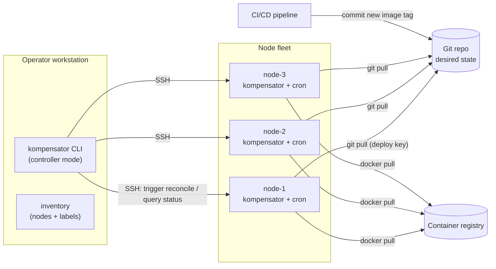
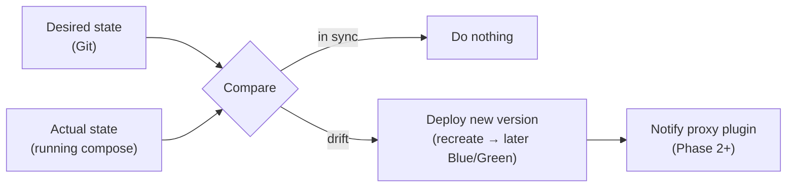
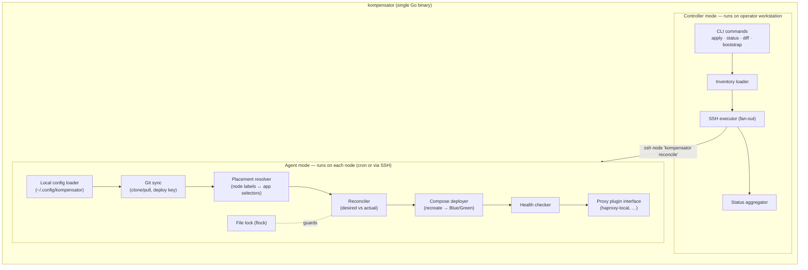
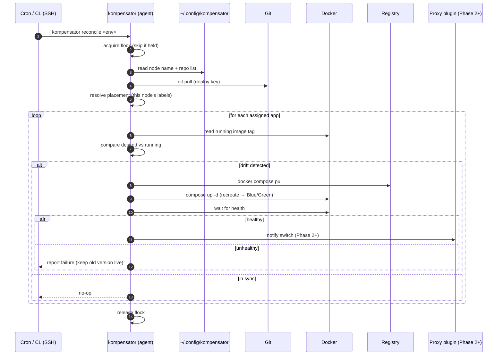
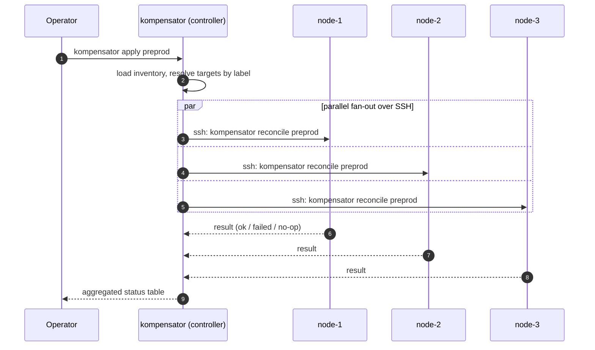
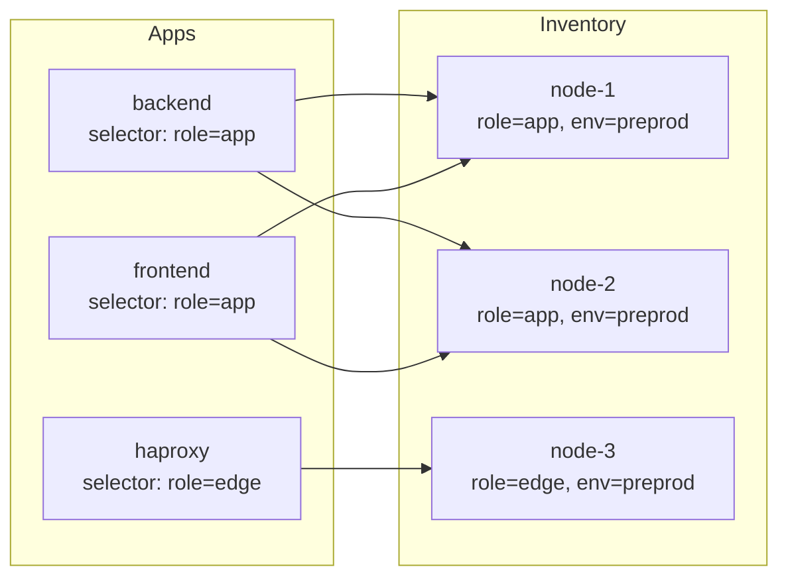
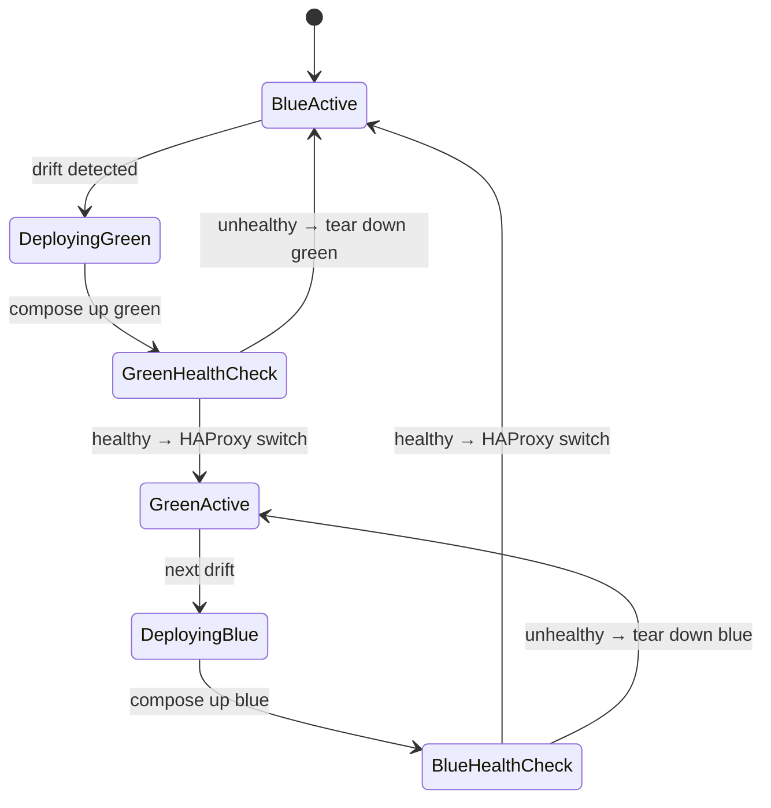
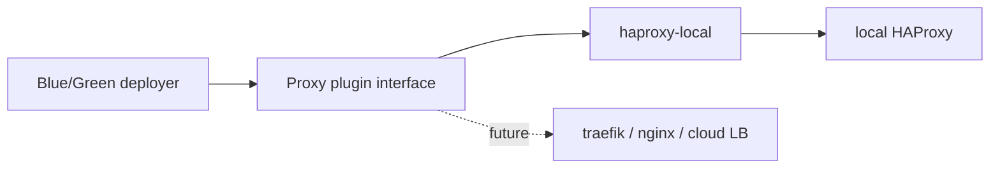
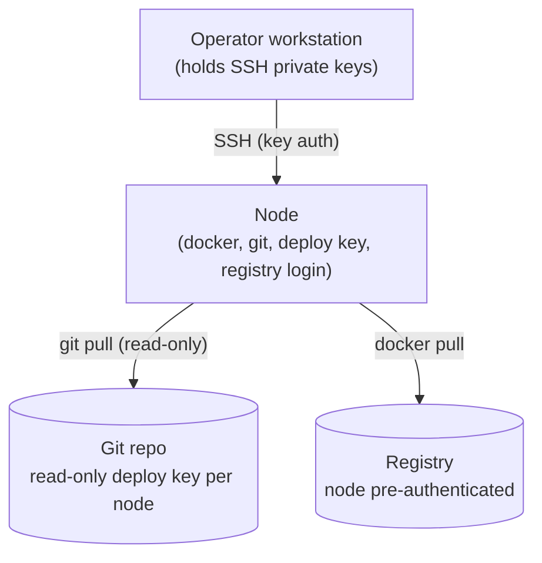

# Architecture

## 1. Overview

kompensator is a **GitOps reconciler for Docker Compose** running on a fleet of
SSH-reachable Linux nodes. A Git repository holds the **desired state**; each node
brings its **actual state** in line with it. There is no central control plane and
no long-running daemon — reconciliation is driven by a per-node **cron** job and can
additionally be **triggered on demand** by the operator's CLI over SSH.

### The reconciliation idea

The actual deployment loop is identical whether started by cron or by the CLI:

> In **Phase 1** the deploy is a simple recreate and there is **no proxy switch and
> no write-back**. Blue/Green + proxy notification arrive in **Phase 2** via the
> pluggable load balancer interface. See [roadmap.md](roadmap.md).

## 2. Why a hybrid pull/push model

| Aspect | How kompensator handles it |
| --- | --- |
| **Self-healing** | Cron runs `kompensator reconcile` on each node every minute. Even if a container dies or a node reboots, the next tick restores desired state. |
| **Fast rollouts** | The operator (or CI) does not want to wait up to a minute. `kompensator apply` from the CLI SSHes into all target nodes and runs the *same* reconcile immediately, in parallel. |
| **No daemon to operate** | No persistent process, no port to expose, no supervisor. The binary runs, reconciles, exits. Simpler to reason about and secure. |
| **Single binary, two modes** | The same `kompensator` binary acts as the **node agent** (`reconcile`) and the **controller/CLI** (`apply`, `status`, …). Behaviour is selected by subcommand. |

> Cron and CLI triggers are mutually exclusive per node via a **file lock** (flock),
> so an on-demand rollout never collides with a scheduled tick.

## 3. Components

### Controller mode (operator workstation)

- **Inventory loader** — reads the node inventory (from the Git repo) and resolves
  label/group selectors to a concrete list of target nodes.
- **SSH executor** — fans out over SSH to the selected nodes and runs
  `kompensator reconcile` (or `kompensator status`) remotely, in parallel.
- **Status aggregator** — collects per-node results and renders a combined view.

### Agent mode (each node)

- **Local config loader** — reads the node's own config under `~/.config/kompensator/`
  (node name + the deployment repo(s) it follows).
- **Git sync** — clones/pulls the deployment repo with a read-only deploy key.
- **Placement resolver** — determines *which apps belong on this node* by matching
  the node's labels against each app's selector.
- **Reconciler** — for every assigned app, compares the desired image tag (Git)
  with the running container's tag (Docker).
- **Compose deployer** — on drift, deploys the new version via Docker Compose
  (recreate in Phase 1; Blue/Green in Phase 2).
- **Proxy plugin** *(Phase 2)* — notifies the configured load balancer of a color
  switch through a pluggable interface; first implementation is `haproxy-local`.
- **Health checker** — waits for container health before switching.

## 4. Reconcile sequence (single node)

> **Phase 1** stops at the deploy + health check (recreate, no proxy, no write-back).
> The proxy notification is added in **Phase 2**.

## 5. Multi-node rollout (parallel)

A rollout does not require the CLI: every node would converge within ~1 minute via
cron anyway. The CLI simply makes it **immediate** by fanning out in parallel.

> **Note on parallelism:** all matching nodes reconcile at once (chosen design).
> Per-node Blue/Green provides zero-downtime *within* a node. There is **no rolling
> deployment** — only Blue/Green — so cross-node rollout gating is not needed. This
> tool targets a realistic fleet of **1–4 nodes**; larger setups are better served by
> Kubernetes or similar.

## 6. Placement: nodes ↔ apps via labels

Nodes carry **labels** (in the inventory). Apps declare a **selector**. An app is
deployed on every node whose labels satisfy the selector. This supports both
"same app replicated everywhere" and "different roles per node".

## 7. Blue/Green lifecycle on a node

> Blue/Green is a **Phase 2** capability enabled by the proxy plugin. In **Phase 1**
> the deployer simply recreates the app in place.

## 8. Load balancer plugin interface (Phase 2)

Traffic switching is abstracted behind a **proxy plugin interface** so multiple load
balancers can be supported over time. The first plugin is `haproxy-local`, which
notifies a locally running HAProxy that a Blue/Green switch occurred.

The MVP interface has two operations:

- **switch** — "switch app X to color Y on this node" (the live traffic flip).
- **get-config** — print a ready-to-use HAProxy backend definition for the app that
  the operator can copy into their HAProxy config.

The interface is intentionally small, keeping each plugin thin and easy to add.

## 9. Trust & security boundaries

- **Nodes are pre-provisioned** out of band: Docker installed (Compose plugin
  **v2.26.0 or newer** — kompensator needs `docker compose config --variables`,
  and deliberately carries no fallback for older versions, since a fallback
  would make the same node deploy differently depending on its compose
  version), Git installed, registry login done (`docker login`), read-only Git
  deploy key in place. kompensator assumes these prerequisites and validates
  them on `bootstrap`.
- **Node-local config** lives under `~/.config/kompensator/` and holds only the node
  name and the deployment repo list — no secrets.
- **SSH** is the only inbound channel to a node; key-based auth, no kompensator port.
- The deploy key is **read-only**: in Phase 1 nodes never push to Git. Git pulls use
  `git pull --rebase` so a node always fast-forwards cleanly onto the remote.
- **Secrets** (app secrets, `.env` values beyond non-secret defaults) are placed
  **out of band** on the node — never committed to Git.
- **Logs** go to **journald** (structured), where a log shipper such as Loki can pick
  them up. No daemon, no built-in log store.
- A **file lock** prevents concurrent reconciles (cron vs. CLI) on the same node.

## 10. Single binary, multiple modes

The same `kompensator` binary runs as the **node agent** (`reconcile`, `bootstrap`)
and as the operator **controller/CLI** (`apply`, `status`, `diff`). Behaviour is
selected by subcommand and by whether it runs on a node or the workstation. The
controller/fleet features arrive after the Phase 1–3 node features; see
[roadmap.md](roadmap.md).
