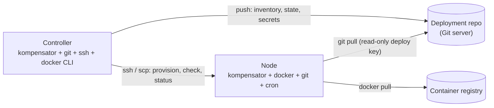

# Getting started

This guide sets up kompensator for the **remote case**: a controller on your
workstation (or a CI/ops host) that provisions and drives one or more
SSH-reachable Linux nodes.

kompensator is a single binary with two roles, decided by what its *home*
directory holds:

| Role | Config file | Where it runs | What it does |
| --- | --- | --- | --- |
| **Controller** | `controller.yml` | operator workstation / ops host | tracks deployment repos, provisions nodes, writes inventory, state and secrets, aggregates status |
| **Node** | `node.yml` | the Docker host | pulls the repo and reconciles itself, driven by cron |



The controller never deploys anything itself. It writes desired state to Git and
prepares the node; the node's cron-driven `kompensator reconcile` does the rest.

## Prerequisites

### On the controller (your workstation)

| Requirement | Why |
| --- | --- |
| `kompensator` binary **built for the node's OS/arch** | `node add` copies *the running binary* to the node over `scp`. A macOS or arm64 controller binary will not run on a linux/amd64 node — see [Cross-platform controllers](#cross-platform-controllers). |
| `ssh` and `scp` in `PATH` | all node operations (provisioning, `check`, teardown) shell out to OpenSSH |
| `git` in `PATH` | the controller clones the deployment repo into `<home>/repos/<name>` and pushes to it |
| `docker` CLI in `PATH` | `kompensator status` queries each node's daemon via `docker -H ssh://…` |
| Non-interactive SSH to every node | kompensator runs ssh with `-o BatchMode=yes`: no password prompts, no key-passphrase prompts, no host-key confirmation |
| **Write** access to the deployment repo | the controller commits and pushes inventory, environments, stacks, state and encrypted secrets |

Non-interactive SSH means, concretely:

- key-based authentication set up for the node's user (`ssh-copy-id`), with the
  key loaded into `ssh-agent` if it has a passphrase;
- the node's host key already in `~/.ssh/known_hosts` — connect once by hand
  before the first `node add`;
- any per-host options (user, port, jump host, identity file) either encoded in
  the `ssh://[user@]host[:port]` location or configured in `~/.ssh/config`.

Verify with:

```bash
ssh -o BatchMode=yes peter@node1.example.org true && echo ok
```

Git pushes use kompensator's own commit identity, so no `user.name` /
`user.email` setup is required — but the credentials for the remote (SSH key or
token helper) must work without a prompt.

### On each node

| Requirement | Detail |
| --- | --- |
| Linux with a POSIX shell | provisioning runs `sh` snippets (`mkdir`, `chmod`, `grep`, `printf`, `crontab`) over ssh |
| A login user with a home directory | the node home defaults to `~/.config/kompensator`; the location's path may override it |
| **Docker Engine + Compose plugin ≥ 2.26.0** | kompensator uses `docker compose config --variables` to fingerprint a deploy; older versions are rejected outright |
| Docker usable **without `sudo`** | the node user must be in the `docker` group, or run rootless Docker |
| `git` installed | the node clones and pulls the deployment repo itself |
| **Read** access to the deployment repo from the node | a read-only deploy key in the node user's `~/.ssh`, with the Git host in `known_hosts` and no passphrase prompt (cron has no agent) |
| A running cron daemon and `crontab` | the self-reconcile loop is a single crontab line in the node user's crontab |
| `logger` (util-linux) | the cron line pipes agent output to syslog (`-t kompensator`), so logs land in the journal instead of an unbounded file |
| Registry login, if images are private | `docker login` on the node, as the node user; kompensator does not manage registry credentials |
| A **free** kompensator home | `node add` refuses if `node.yml` already exists; run `node remove` first |

What the node does **not** need: Go, the `age` CLI, or push access — unless you
enable status write-back (see below). kompensator generates the node's age
identity on the controller and writes it to `<home>/age.key` (mode `0600`); the
private key never travels back.

Verify the important ones from the controller:

```bash
ssh peter@node1.example.org 'docker compose version && git --version && command -v crontab logger'
```

### On the Git server

- One repository for the deployment state, on one branch (default `main`).
- The controller's account: **read/write**.
- Each node's deploy key: **read-only** is enough for the normal case.
- If you provision nodes with `--status-writeback`, each node pushes its own
  status branch (`<branch>-status/<node>`) — that key then needs **write**
  access, ideally restricted to those refs.

### Network paths

| From | To | Protocol |
| --- | --- | --- |
| controller | node | SSH (port 22 or the port in the location URL) |
| controller | Git server | whatever the repo URL uses (usually SSH) |
| node | Git server | same |
| node | container registry | HTTPS |

Nodes need no inbound access from anywhere except the controller's SSH.

### Cross-platform controllers

`node add` copies the controller's own binary to the node. If your workstation is
not the same OS/arch as your nodes, build a matching binary and run the
controller through it:

```bash
GOOS=linux GOARCH=amd64 CGO_ENABLED=0 \
  go build -trimpath -ldflags "-s -w -X main.buildVersion=$(git describe --tags --always)" \
  -o bin/kompensator-linux-amd64 ./cmd/kompensator
```

The straightforward alternative is to keep the controller home on a small Linux
ops host and drive it over SSH.

## Prerequisite checklist

```text
Controller
  [ ] kompensator binary matching the nodes' OS/arch
  [ ] ssh, scp, git, docker in PATH
  [ ] BatchMode ssh works to every node (key auth, known_hosts, agent loaded)
  [ ] push access to the deployment repo

Each node
  [ ] Linux user with a home directory, sudo-free docker access
  [ ] Docker Compose >= 2.26.0
  [ ] git + read-only deploy key, Git host in known_hosts
  [ ] cron daemon running, crontab and logger available
  [ ] docker login for private registries
  [ ] no existing ~/.config/kompensator/node.yml
```

## Walkthrough

### 1. Install the binary

```bash
go install github.com/kratecorg/kompensator/cmd/kompensator@latest
```

or grab a release binary, or `make build` from a clone (Go 1.24+).

### 2. Initialise the controller home

```bash
kompensator -home /opt/controller controller init
```

This writes `controller.yml`. Without `-home`, the home is `$KOMPENSATOR_HOME`,
else `$XDG_CONFIG_HOME/kompensator`, else `~/.config/kompensator`.

### 3. Add the deployment repo

```bash
kompensator -home /opt/controller controller repo add prod \
  ssh://git@git.example.org/acme/deploy.git --branch main
```

The repo is cloned into `/opt/controller/repos/prod`. An empty repository is
fine: kompensator creates the branch and an initial `inventory/nodes.yml`.

### 4. Provision a node

```bash
kompensator -home /opt/controller node add node1 ssh://peter@node1.example.org
```

This copies the binary, writes `node.yml` and a fresh `age.key`, clones the repo
on the node, installs the reconcile crontab entry, registers the node in
`inventory/nodes.yml` (commit + push) and rekeys every environment's secrets so
the new node can decrypt them.

Useful flags: `--schedule '*/5 * * * *'` for a slower loop, `--status-writeback`
to publish reconcile status to Git (requires a write-capable deploy key on the
node), `--repo <name>` when the controller tracks more than one repo.

The location is `ssh://[user@]host[:port][/path]`; the path defaults to
`~/.config/kompensator`. An absolute path instead of a URL provisions a node on
the controller's own host.

### 5. Confirm the setup

```bash
kompensator -home /opt/controller check
```

On a controller this re-executes the agent on every inventory node over SSH and
reports config, binary, version, age key, repo checkout and cron entry per node.
It self-heals a missing checkout or a drifted crontab line.

### 6. Describe what should run

```bash
kompensator -home /opt/controller stack add shop --proxy traefik
kompensator -home /opt/controller project add shop api --port 8080 --route
kompensator -home /opt/controller env add prod --var LOG_LEVEL=info
kompensator -home /opt/controller env stack add prod shop --node node1
echo 'DB_PASSWORD: s3cr3t' | kompensator -home /opt/controller secrets set prod shop
```

Every one of these commits and pushes; add `--dry-run` to see the diff first.

### 7. Deploy

```bash
kompensator -home /opt/controller state set prod shop api api \
  registry.example.org/api:v1.4.2
kompensator -home /opt/controller verify prod --wait
```

`state set` is the call a CI pipeline makes. The nodes pick the change up on
their next cron tick; `verify` polls Git until every node hosting the
environment reports the desired commit and healthy. `kompensator status` shows
desired vs. running images across the fleet.

## Troubleshooting the setup

| Symptom | Cause |
| --- | --- |
| `Permission denied (publickey)` during `node add` | key auth not set up, or the key needs a passphrase and no agent is loaded — `BatchMode=yes` forbids prompting |
| `Host key verification failed` | the node is not in `known_hosts`; connect once interactively first |
| `config already exists at host:…/node.yml` | the home is already provisioned; `node remove` it first, or pick another path in the location |
| `needs Docker Compose >= 2.26.0` | the node's compose plugin is too old |
| `permission denied … docker.sock` | the node user is not in the `docker` group |
| Node never reconciles although `check` passes | cron daemon not running, or the deploy key needs a passphrase (cron has no agent) |
| `git push` failures on the controller | the controller's repo credentials prompt, or lack write access |
| Node cannot pull the repo | deploy key missing on the node, or the Git host is not in the node user's `known_hosts` |

## Next steps

- [concepts.md](concepts.md) — environments, stacks, projects, placement
- [repository-layout.md](repository-layout.md) — what the deployment repo holds
- [architecture.md](architecture.md) — how reconciliation works
