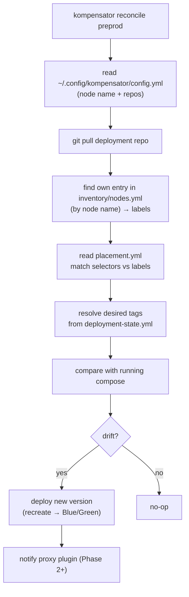

# Repository Layout

kompensator uses two kinds of configuration:

1. **Node-local config** (on each node, under `~/.config/kompensator/`) — identifies
   the node and which deployment repo(s) it follows.
2. **Deployment repo(s)** (in Git) — the GitOps source of truth describing the
   desired state, placement, and compose files. This is separate from the
   kompensator source code repository.

## Node-local config

Created manually in Phase 1 (by `kompensator node add` later). Holds no secrets.

```
~/.config/kompensator/
├── config.yml            # node name + deployment repos
└── repos/                # checked-out deployment repo(s)
    └── deployment-repo/
```

```yaml
# ~/.config/kompensator/config.yml
node:
  name: node-1            # how this node finds itself in the inventory

repos:
  - name: deployment-repo
    url: git@git.example.com:acme/deployment-repo.git
    branch: main
    # pulled with a read-only deploy key already present on the host
```

> The config dir defaults to `~/.config/kompensator/` (falls back to
> `~/.kompensator/` if `$XDG_CONFIG_HOME` conventions are not used).

## Deployment repo structure

```
deployment-repo/
├── kompensator.yml                 # repo-level config: defaults, proxy
├── inventory/
│   └── nodes.yml                   # node definitions + labels
├── environments/
│   ├── preprod/
│   │   ├── deployment-state.yml    # DESIRED state: image tags (updated by CI)
│   │   ├── placement.yml           # which apps run where (selectors → labels)
│   │   ├── infra.yml               # infra compose (db, identity, …)
│   │   ├── app.yml                 # app compose template
│   │   └── .env                    # non-secret env (secrets handled out of band)
│   └── prod/
│       └── …
└── templates/                      # shared compose fragments
```

## `inventory/nodes.yml`

```yaml
nodes:
  - name: node-1
    host: 10.0.0.11        # ssh target
    user: deploy
    labels:
      role: app
      env: preprod
  - name: node-2
    host: 10.0.0.12
    user: deploy
    labels:
      role: app
      env: preprod
  - name: node-3
    host: 10.0.0.13
    user: deploy
    labels:
      role: edge
      env: preprod
```

## `environments/preprod/deployment-state.yml`

The desired image tags — this is what CI updates on every build.

```yaml
# Desired state for preprod (updated automatically by CI)
backend:
  image: registry.example.com/acme/backend
  tag: 9f8dc0d34d3298a75688644278b3019095b385a0
frontend:
  image: registry.example.com/acme/frontend
  tag: 9f8dc0d34d3298a75688644278b3019095b385a0
```

> **Phase 1 writes nothing back here.** A `metadata` block (`last_deployed`,
> `deployed_by`, `commit_sha`) may be added as an optional audit trail in a later
> phase — see [roadmap.md](roadmap.md).

## `environments/preprod/placement.yml`

The new piece that enables multi-node, label-based placement.

```yaml
apps:
  - name: backend
    selector: { role: app }       # runs on node-1, node-2
    strategy: blue-green          # Phase 2; Phase 1 uses recreate
  - name: frontend
    selector: { role: app }
    strategy: blue-green
  - name: haproxy
    selector: { role: edge }      # runs on node-3
    strategy: recreate
```

## `kompensator.yml`

```yaml
defaults:
  reconcile_interval: 60s          # cron cadence reference (informational)
  health_timeout: 300s
  lock_file: /run/kompensator.lock

proxy:
  plugin: haproxy-local            # Phase 2; pluggable load balancer
```
## How a node resolves its work



## Notes

- `placement.yml` and `inventory/nodes.yml` provide multi-node, label-based
  placement; a node finds itself in the inventory by the **name** in its node-local
  config.
- **Phase 1 never writes to Git** (read-only deploy key); pulls use
  `git pull --rebase`. Optional metadata write-back is a later phase.
- Secrets are placed **out of band** on the node (registry login lives on the node;
  `.env` holds non-secret values only). kompensator does not manage secrets.

## Variable resolution

Compose files reference variables (`${VAR}` / `${VAR:-default}`) that kompensator
injects at deploy time. A value can be declared in several scopes; every scope
carries an optional `variables` map (all nodes) and a `nodeVariables` map keyed
by node name (only the reconciling node's entry applies).

The scopes are layered **broad to narrow**, each overriding the previous:

| # | Scope | Where |
|---|-------|-------|
| 0 | Stack defaults | `stacks/<stack>/stack.yml` → `variables` |
| 1 | Environment | `environments/<env>/env.yml` → `variables` |
| 2 | Environment + node | `environments/<env>/env.yml` → `nodeVariables[node]` |
| 3 | Stack placement | `env.yml` → `stacks[]` → `variables` |
| 4 | Stack placement + node | `env.yml` → `stacks[]` → `nodeVariables[node]` |
| 5 | Project placement | `env.yml` → `stacks[].projects[]` → `variables` |
| 6 | Project placement + node | `env.yml` → `stacks[].projects[]` → `nodeVariables[node]` |
| — | Decrypted secrets | `environments/<env>/secrets/<stack>.yml.age` (win over all of the above) |
| — | Identity built-ins | `NODE_NAME`, `ENV_NAME`, `<SERVICE>_IMAGE/_TAG` (always win) |

Two rules follow from the ordering:

1. **A narrower scope wins over a broader one** — so an inner *all-nodes* value
   (e.g. a project's `variables`) beats an outer *per-node* value (e.g. the
   environment's `nodeVariables`).
2. **Within a scope, the per-node layer wins over the all-nodes one.**

This is why resource limits (a service property that depends on the node it lands
on) belong on the **project placement** in an env — with a `nodeVariables` entry
for the nodes that need to diverge — rather than on the environment, which cannot
distinguish nodes for a project that spans several of them.

### Example

```yaml
# environments/example/env.yml
name: example
variables:
  MAIN: "Environment variable"
  ENV_LONG_NAME: "Example Environment"
nodeVariables:
  customer02:
    MAIN: "Environment variable - Customer02"
    ENV_LONG_NAME: "Example Environment - Customer02"
stacks:
  - name: stack1
    variables:
      MAIN: "Stack variable"
      STACK_LONG_NAME: "Stack 1"
    nodeVariables:
      customer01: { MAIN: "Stack variable - Customer01", STACK_LONG_NAME: "Stack 1 - Customer01" }
      customer02: { MAIN: "Stack variable - Customer02", STACK_LONG_NAME: "Stack 1 - Customer02" }
    projects:
      - name: app
        nodes: [customer01, customer02]
        variables:
          MAIN: "Project variable"
          PROJECT_LONG_NAME: "Application Project"
        nodeVariables:
          customer01: { MAIN: "Project variable - Customer01", PROJECT_LONG_NAME: "Application Project - Customer01" }
```

Resolving `app`:

| Variable | customer01 | customer02 |
|----------|------------|------------|
| `MAIN` | `Project variable - Customer01` (L6) | `Project variable` (L5 — no L6 for c02) |
| `PROJECT_LONG_NAME` | `Application Project - Customer01` (L6) | `Application Project` (L5) |
| `STACK_LONG_NAME` | `Stack 1 - Customer01` (L4) | `Stack 1 - Customer02` (L4) |
| `ENV_LONG_NAME` | `Example Environment` (L1) | `Example Environment - Customer02` (L2) |

