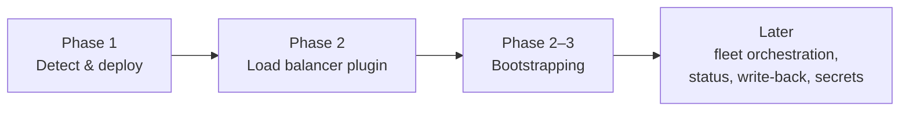
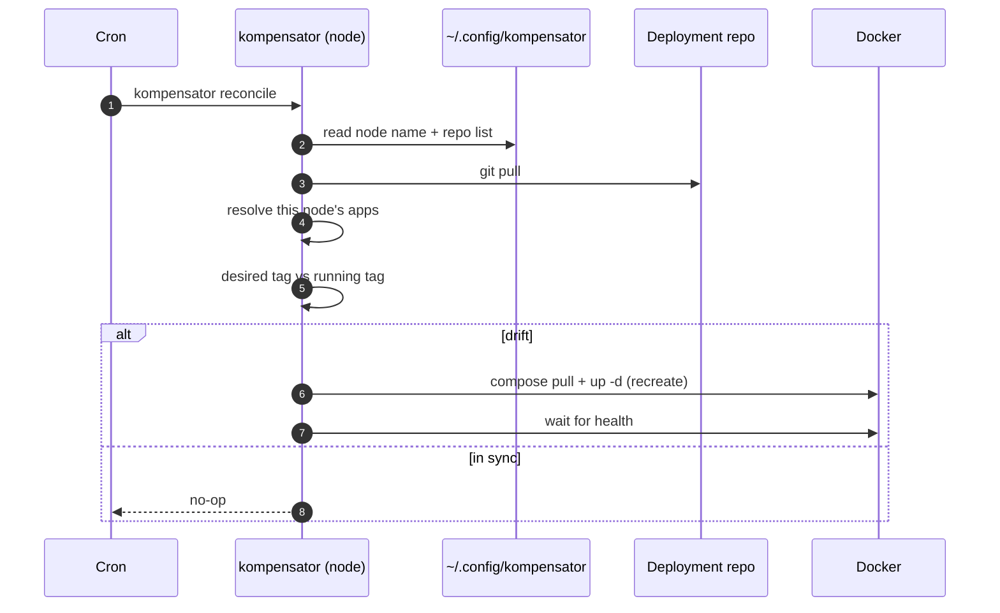
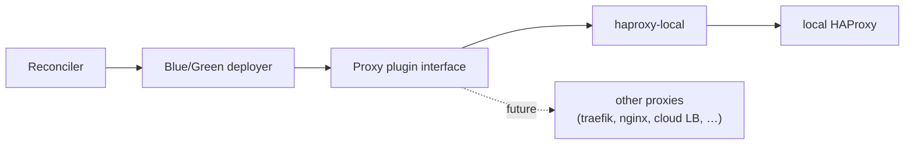
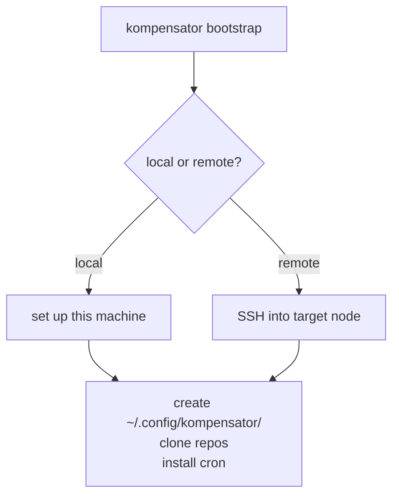

# Roadmap — Implementation Phases

kompensator is built incrementally. Each phase delivers something usable on its own
and lays the groundwork for the next.

## Phase 1 — Detect & deploy

**Goal:** A node detects that its deployment repo has a new version and deploys it.

Scope:

- A node has a **local config** (created manually for now) under
  `~/.config/kompensator/` declaring its **name** and the **deployment repo(s)** it follows.
- `kompensator reconcile` on the node:
  1. pulls the deployment repo,
  2. resolves which apps belong to this node (by name → labels → selectors),
  3. compares the desired image tag against the running container,
  4. on drift, deploys the new version with Docker Compose.
- Triggered by **cron** on the node and/or **manually** by running the command.

Explicitly **out of scope** in Phase 1:

- ❌ No load balancer / proxy switch (deploy strategy is a simple **recreate**).
- ❌ No write-back of the current deployment state to Git.
- ❌ No `bootstrap` command (config is created by hand).
- ❌ No multi-node fan-out / aggregated status from a controller.

## Phase 2 — Load balancer plugin

**Goal:** Zero-downtime switches via a **pluggable proxy interface**.

Scope:

- Introduce a **proxy plugin interface** so multiple load balancers can be supported
  over time. The MVP interface has two operations:
  - **switch** — "switch app X to color Y on this node".
  - **get-config** — print a ready-to-copy HAProxy backend definition for an app.
- First implementation: **`haproxy-local`** — a locally running HAProxy is notified
  that a Blue/Green switch happened and routes traffic to the new color.
- Deploy strategy gains **Blue/Green**: deploy to the inactive color, health-check,
  then notify the proxy plugin to switch, then stop the old color.

> HAProxy is the first choice because it is what is used in practice; the interface
> keeps the door open for other proxies later.

## Phase 2–3 — Bootstrapping

**Goal:** Stand up a node (or the local machine) without hand-editing config.

`kompensator bootstrap`:

- creates the config folder under `~/.config/kompensator/`,
- writes the node name and deployment repo list,
- checks out the configured deployment repo(s),
- installs the **cron job** that runs `kompensator reconcile`.

Two modes:

- **Local bootstrap** — run on the machine itself (e.g. a single-node setup).
- **Remote bootstrap** — run from an operator workstation, performing the above on a
  target node over SSH.

## Later phases (not yet scheduled)

- **Fleet orchestration & status:** controller-mode `apply` (parallel SSH fan-out)
  and aggregated `status`/`diff` across nodes.
- **State write-back:** optionally record deployment metadata back to Git as an audit
  trail (deliberately **not** in Phase 1).

Decided non-goals (kept simple on purpose):

- **No rolling deployments** — only Blue/Green, so no cross-node rollout gating.
- **No secret management** — secrets live **out of band** on the node.
- **Targets 1–4 nodes** — larger fleets should use Kubernetes or similar.
